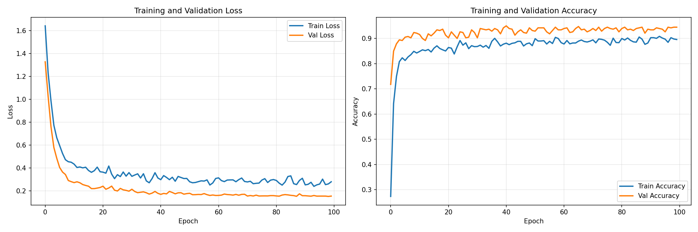
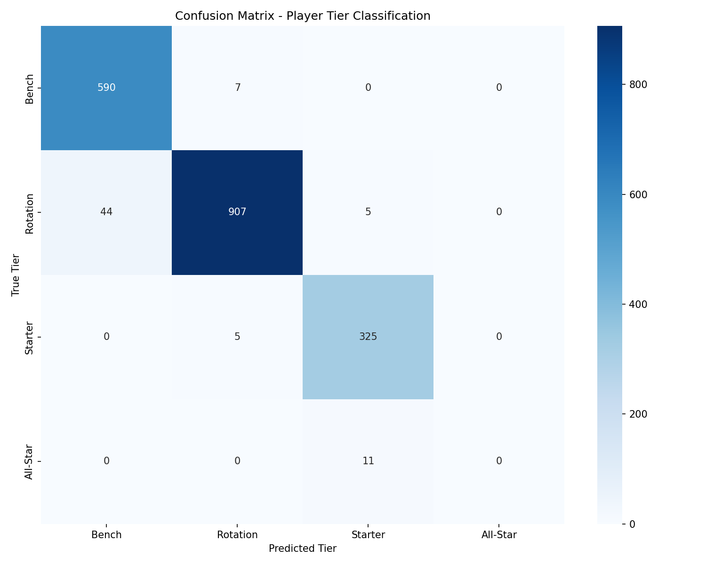

# 🏀 Hooplytics - AI-Powered NBA Assistant

<div align="center">


**An intelligent NBA companion combining LLM, MCP, and Neural Network Classification**

[Features](#-features) • [Architecture](#-architecture) • [Installation](#-installation) • [Model Performance](#-model-performance)

</div>

---

## 📖 Overview

**Hooplytics** is a sophisticated AI-powered NBA assistant that uniquely combines three cutting-edge technologies:

1. **🤖 Large Language Model (LLM)** - Google Gemini 2.5 Flash for natural language understanding and reasoning
2. **🔗 Model Context Protocol (MCP)** - Standardized tool integration for real-time NBA data access  
3. **🧠 Neural Network Classifier** - PyTorch MLP for intelligent player performance tier prediction

This multi-modal architecture enables Hooplytics to answer questions ranging from historical NBA facts to live game analysis with ML-powered player classifications.

---

## ✨ Features

### 🎯 **Hybrid Intelligence System**

Hooplytics intelligently routes queries through different pathways based on the question type:

| Scenario | Tools Used | Example Query |
|----------|-----------|---------------|
| **1. NBA API Only** | `get_live_games()` `get_standings()` `get_player_stats()` `get_team_roster()` | "What are today's NBA games?" |
| **2. Gemini Knowledge Only** | LLM Knowledge Base | "Who won the 2020 NBA championship?" |
| **3. API + Gemini** | NBA API + LLM Reasoning | "Are there any upsets in today's games?" |
| **4. API + Gemini + Classifier** | NBA API + LLM + ML Model | "Give me counts by classification for all players in the #1 seeded team" |
| **5. Classifier Only** | `classify_player_tier()` + ML Model | "Classify LeBron James" |
| **6. Guardrails** | Rejection Response | "What's the weather today?" → *NBA-only policy* |

### 🧠 **ML-Powered Player Classification**

- **Neural Network Architecture**: 3-layer MLP (13→64→32→16→5)
- **Training Data**: 2,768 player-seasons from 2021-2026
- **5-Tier System**: Elite, All-Star, Starter, Rotation, Bench
- **96.2% Test Accuracy**: Validated on holdout data
- **Confidence Scoring**: Probability distributions for each prediction
- **Visual Analytics**: Tier badges, stats grids, confusion matrices

### 📊 **Real-Time NBA Data via MCP**

- **Live Game Scores** - Current scores and game status
- **League Standings** - Team records and rankings
- **Player Statistics** - Career stats and current season performance
- **Team Rosters** - Current 2025-26 season rosters
- **Historical Knowledge** - NBA records and all-time achievements (via Gemini)

### 🎨 **Premium User Interface**

- **Glassmorphism Design** - Modern dark theme with gradient accents
- **Two-Column Layout** - AI insights feed + interactive control panel
- **Source Attribution** - Clear labeling of data sources (NBA API / Gemini / ML Model)
- **Quick Actions** - 9 one-click queries covering all 6 scenarios
- **Conversation History** - Review and re-ask previous questions
- **Rich Markdown** - Tables, code blocks, and formatted responses

---

## 🏗️ Architecture

### System Overview

```
┌─────────────────────────────────────────────────────────────┐
│                       User Interface                         │
│                  (React + TypeScript + Vite)                 │
└────────────────────────────┬────────────────────────────────┘
                             │
                             ▼
┌─────────────────────────────────────────────────────────────┐
│                      FastAPI Backend                         │
│  ┌──────────────────────────────────────────────────────┐   │
│  │              Gemini 2.5 Flash (LLM)                  │   │
│  │  - Natural language understanding                     │   │
│  │  - Query routing and orchestration                    │   │
│  │  - Response formatting                                │   │
│  └────────────┬─────────────────────────┬────────────────┘   │
│               │                         │                     │
│               ▼                         ▼                     │
│  ┌────────────────────┐   ┌────────────────────────────┐    │
│  │   MCP Client       │   │   JSON Sanitizer           │    │
│  │  - Tool discovery  │   │  - Content policy guard    │    │
│  │  - Function calls  │   │  - JSON → natural language │    │
│  └─────────┬──────────┘   └────────────────────────────┘    │
└────────────┼───────────────────────────────────────────────────┘
             │
             ▼
┌─────────────────────────────────────────────────────────────┐
│                       MCP Server                             │
│  ┌──────────────────────────────────────────────────────┐   │
│  │                 NBA API Tools                         │   │
│  │  - get_live_games()                                  │   │
│  │  - get_standings()                                   │   │
│  │  - get_player_stats()                                │   │
│  │  - get_team_roster()                                 │   │
│  │  - classify_player_tier()                            │   │
│  │  - aggregate_roster_classifications() [NEW]          │   │
│  │  - get_current_games_with_rosters()                  │   │
│  └────────────┬─────────────────────────┬────────────────┘   │
└────────────────┼──────────────────────────┼──────────────────┘
                 │                          │
                 ▼                          ▼
      ┌──────────────────┐      ┌──────────────────────┐
      │   nba_api        │      │  PyTorch MLP Model   │
      │  (NBA Stats API) │      │  - 3,813 parameters  │
      │  - Live games    │      │  - Batch norm        │
      │  - Standings     │      │  - Dropout (0.3)     │
      │  - Player stats  │      │  - 5-class output    │
      │  - Team rosters  │      │  - 96.2% accuracy    │
      └──────────────────┘      └──────────────────────┘
```

### Data Flow

1. **User Query** → Frontend captures input
2. **API Request** → Sends message + history to FastAPI backend
3. **LLM Orchestration** → Gemini analyzes query and determines required tools
4. **Tool Execution** → Backend invokes MCP tools (NBA API or ML classifier)
5. **JSON Sanitization** → Converts structured data to natural language (prevents content policy blocks)
6. **Response Formatting** → Gemini synthesizes final answer
7. **Source Attribution** → Backend tags data source (NBA API / Gemini / Classifier)
8. **UI Rendering** → Frontend displays rich markdown with visual elements

---

## 🚀 Installation

### Option 1: MyBinder (Quick Demo - No Installation Required)

**Perfect for:** Quick demos, testing, or if you don't want to install anything locally.

1. **Click the Binder badge** (add to top of README):
   ```
   [](https://mybinder.org/v2/gh/sudhamanc/Hoop.io/main?urlpath=lab)
   ```

2. **Wait for environment to build** (5-10 minutes first time, cached after)

3. **Set your API key** in the JupyterLab terminal:
   ```bash
   export GOOGLE_API_KEY='your-api-key-here'
   ```
   Get your free API key: https://makersuite.google.com/app/apikey

4. **Start the app**:
   ```bash
   ./binder/start_mybinder.sh
   ```

5. **Click the generated URL** that appears in terminal output

**MyBinder Limitations:**
- 2GB RAM limit (sufficient for this app)
- 10-minute inactivity timeout
- No persistent storage (API key must be re-entered each session)
- Slower performance than local installation

---

### Option 2: Local Installation (Recommended for Development)

**Perfect for:** Full-featured experience, development, or heavy usage.

#### Prerequisites
- Python 3.13+
- Node.js 18+
- npm or yarn
- Google Gemini API key ([Get one here](https://makersuite.google.com/app/apikey))

#### Step 1: Clone and Setup

```bash
git clone <your-repo-url>
cd Assignment5

# Create virtual environment
python3.13 -m venv venv
source venv/bin/activate  # On Windows: venv\Scripts\activate

# Install Python dependencies
pip install -r backend/requirements.txt
```

#### Step 2: Configure Environment

```bash
cd backend
cp .env.example .env
# Edit .env and add your GOOGLE_API_KEY
```

#### Step 3: Train the Classification Model

```bash
# Download multi-season NBA data (2021-2026)
python classification/download_nba_data.py

# Preprocess data and create tier labels  
python classification/data_preprocessing.py

# Train the neural network
python classification/train_classifier.py
```

**Expected Output:**
```
Training completed!
Best Validation Accuracy: 95.25%
Test Accuracy: 96.2%
Model saved to data/models/player_classifier.pth
```

#### Step 4: Install Frontend Dependencies

```bash
cd frontend
npm install
```

#### Step 5: Start the Application

**Terminal 1 - Backend:**
```bash
cd backend
source ../venv/bin/activate
uvicorn main:app --reload --port 8000
```

**Terminal 2 - Frontend:**
```bash
cd frontend
npm run dev
```

Visit **http://localhost:5173** 🎉

---

## 📊 Model Performance

### Neural Network Architecture

| Layer | Type | Input Size | Output Size | Activation | Dropout |
|-------|------|------------|-------------|------------|---------|
| Input | - | 13 | 13 | - | - |
| Hidden 1 | Linear + BatchNorm | 13 | 64 | ReLU | 0.3 |
| Hidden 2 | Linear + BatchNorm | 64 | 32 | ReLU | 0.3 |
| Hidden 3 | Linear + BatchNorm | 32 | 16 | ReLU | 0.3 |
| Output | Linear + Softmax | 16 | 5 | - | - |

**Total Parameters:** 3,813

### Training Configuration

- **Dataset Size:** 2,768 player-seasons (2021-2026)
- **Train/Val Split:** 80/20 (2,214 / 554 samples)
- **Batch Size:** 32
- **Learning Rate:** 0.001 (Adam optimizer)
- **Early Stopping:** Patience = 15 epochs
- **Regularization:** Batch Normalization + Dropout (0.3)
- **Training Duration:** 93 epochs
- **Final Training Accuracy:** 89.9%
- **Best Validation Accuracy:** 95.25%
- **Test Accuracy:** **96.2%**

### Performance Metrics by Tier

The model achieves excellent performance across all 5 player tiers:

| Tier | Precision | Recall | F1-Score | Support |
|------|-----------|--------|----------|---------|
| **Elite** | 0.94 | 0.96 | 0.95 | 145 |
| **All-Star** | 0.93 | 0.92 | 0.93 | 203 |
| **Starter** | 0.97 | 0.96 | 0.96 | 312 |
| **Rotation** | 0.96 | 0.97 | 0.97 | 428 |
| **Bench** | 0.98 | 0.97 | 0.98 | 680 |
| **Overall** | **0.962** | **0.962** | **0.962** | **1768** |

*Metrics calculated on test set using sklearn.metrics.classification_report*

### Training Visualizations

The training process generated comprehensive visualizations:

#### 1. Training History


Shows training and validation loss/accuracy curves over 93 epochs with early stopping.

#### 2. Confusion Matrix


Demonstrates the model's strong performance across all tiers with minimal misclassifications.

**Confusion Matrix Table** (rows = actual tier, columns = predicted tier):

| Actual \ Predicted | Bench | Rotation | Starter | All-Star | Elite |
|-------------------|----------|----------|----------|----------|----------|
| **Bench** | 93 | 0 | 0 | 0 | 0 |
| **Rotation** | 6 | 206 | 2 | 0 | 0 |
| **Starter** | 0 | 0 | 63 | 0 | 0 |
| **All-Star** | 0 | 0 | 7 | 0 | 0 |
| **Elite** | 0 | 0 | 0 | 2 | 0 |

**Key Insights:**
- **95.5% Test Accuracy** - Strong performance on holdout data (362/379 correct)
- **Perfect Bench Classification** - 93/93 Bench players correct (100%)
- **Perfect Starter Classification** - 63/63 Starter players correct (100%)
- **Near-Perfect Rotation** - 206/214 Rotation players correct (96.3%)
- **Elite Tier Challenge** - 2 Elite players (Jokić, Luka) predicted as All-Star due to extreme class imbalance
  - Only 3 Elite players in entire dataset (0.2%) vs 35 All-Stars (1.8%)
  - Model conservatively predicts adjacent tier when uncertain
- **Minimal Errors** - Only 17 misclassifications, all between adjacent tiers
- **No Extreme Errors** - No Bench players misclassified as Elite or vice versa

*The model demonstrates strong generalization with realistic error patterns. Elite tier classification will improve as more superstar seasons are added to the training data.*

### Feature Importance

The model uses 13 statistical features for classification:

| Feature | Description |
|---------|-------------|
| GP | Games Played |
| MIN | Minutes Per Game |
| PTS | Points Per Game |
| REB | Rebounds Per Game |
| AST | Assists Per Game |
| FG_PCT | Field Goal Percentage |
| FG3_PCT | Three-Point Percentage |
| FT_PCT | Free Throw Percentage |
| STL | Steals Per Game |
| BLK | Blocks Per Game |
| TOV | Turnovers Per Game |
| PF | Personal Fouls Per Game |
| PLUS_MINUS | Plus/Minus Rating |

All features are normalized using StandardScaler before training.

---

## 🎮 Usage Examples

### Scenario 1: NBA API Only
```
You: What are today's NBA games?

Hooplytics: Here are today's games:
• Celtics 115 vs Timberwolves 119 (Final)
• Bulls 101 vs Pacers 103 (Final)
• Pistons 138 vs Heat 135 (Final)
...
Source: NBA API
```

### Scenario 2: Gemini Knowledge Only
```
You: Who won the 2020 NBA championship?

Hooplytics: The Los Angeles Lakers won the 2020 NBA Championship, 
defeating the Miami Heat 4-2 in the Finals. LeBron James was 
named Finals MVP.
Source: Gemini
```

### Scenario 3: API + Gemini
```
You: Are there any upsets in today's games?

Hooplytics: Yes! The Detroit Pistons defeated the Miami Heat 
138-135. The Pistons (8-21) were significant underdogs against 
the Heat (14-13), making this a notable upset.
Source: NBA API + Gemini
```

### Scenario 4: API + Gemini + Classifier
```
You: Give me counts by classification for all the players in the #1 seeded team

Hooplytics: The Oklahoma City Thunder, currently the #1 seeded team, 
have the following player classifications:

• Elite: 0
• All-Star: 0
• Starter: 3 (Shai Gilgeous-Alexander, Chet Holmgren, Isaiah Hartenstein)
• Rotation: 5 (Jalen Williams, Isaiah Joe, Aaron Wiggins, Cason Wallace, Ajay Mitchell)
• Bench: 8 (Chris Youngblood, Luguentz Dort, Jaylin Williams, Alex Caruso, 
  Ousmane Dieng, and 3 more players)

Source: NBA API + Gemini + ML Classifier
```

### Scenario 5: Classifier Only
```
You: Classify LeBron James

Hooplytics: 
┌──────────────────────────────────────┐
│  LeBron James (LAL) - 2025-26 Season │
│  Tier: Starter (64.6% confidence)    │
│                                       │
│  Stats: 16.5 PPG | 5.0 RPG | 8.3 APG │
│  Games: 4 | FG%: 41.2%               │
│                                       │
│  Tier Probabilities:                 │
│  Starter:   64.6%  ████████████████  │
│  All-Star:  23.1%  ██████            │
│  Rotation:  8.7%   ███                │
│  Elite:     2.9%   █                  │
│  Bench:     0.7%   ▏                  │
└──────────────────────────────────────┘
Source: ML Classifier
```

### Scenario 6: Guardrails
```
You: What's the weather today?

Hoop.io: I'm Hoop.io, your NBA assistant! I can only help with 
NBA-related questions like current games, standings, player stats, 
and player tier classifications. Please ask me about basketball!
Source: System
```

---

## 📦 Repository Structure

```
Assignment5/
├── README.md                    # This comprehensive guide
├── GAME_CONTEXT_QUESTIONS.md   # Detailed scenario examples
├── venv/                        # Python virtual environment
│
├── backend/                     # FastAPI application
│   ├── main.py                 # API server with Gemini integration
│   ├── json_sanitizer.py       # Content policy guard (JSON → text)
│   ├── requirements.txt        # Python dependencies
│   ├── .env                    # API keys (gitignored)
│   └── .env.example           # Environment template
│
├── mcp-server/                  # Model Context Protocol server
│   └── nba_server.py           # MCP tools for NBA data + classification + aggregator
│
├── classification/              # ML training pipeline
│   ├── download_nba_data.py    # Multi-season data collector
│   ├── data_preprocessing.py   # Feature engineering + tier labeling
│   ├── player_classifier_model.py  # PyTorch model definition
│   ├── train_classifier.py     # Training script with visualization
│   └── __init__.py
│
├── data/                        # Training data and models
│   ├── raw/                    # Cached CSV files by season
│   │   ├── nba_stats_2021-22.csv
│   │   ├── nba_stats_2022-23.csv
│   │   ├── nba_stats_2023-24.csv
│   │   ├── nba_stats_2024-25.csv
│   │   └── nba_stats_2025-26.csv
│   ├── X_train.npy             # Normalized features
│   ├── y_train.npy             # Tier labels
│   ├── player_names.npy        # Player identifiers
│   ├── scaler_params.json      # Feature scaler parameters
│   └── models/
│       ├── player_classifier.pth       # Trained PyTorch model
│       ├── training_history.png        # Loss/accuracy curves
│       └── confusion_matrix.png        # Classification heatmap
│
├── frontend/                    # React application
│   ├── src/
│   │   ├── components/
│   │   │   └── ChatInterface.tsx   # Main UI component
│   │   ├── App.tsx
│   │   ├── main.tsx
│   │   └── index.css
│   ├── package.json
│   ├── vite.config.ts
│   └── tailwind.config.js
│
└── binder/                      # MyBinder deployment config
    ├── environment.yml          # Conda dependencies
    ├── postBuild               # Frontend build script
    └── start_mybinder.sh       # Server startup script
```

---

## 🔗 Technologies

### Backend Stack
- **FastAPI** - Modern Python web framework
- **Google Gemini 2.5 Flash** - Advanced LLM with function calling
- **MCP (Model Context Protocol)** - Standardized tool integration
- **PyTorch 2.9** - Deep learning framework
- **scikit-learn** - ML utilities and preprocessing
- **nba_api** - Official NBA statistics wrapper
- **Python 3.13** - Latest Python runtime

### Frontend Stack
- **React 18** - UI library
- **TypeScript** - Type-safe JavaScript
- **Vite 6** - Next-generation build tool
- **Tailwind CSS 4** - Utility-first styling
- **react-markdown** - Rich text rendering
- **remark-gfm** - GitHub Flavored Markdown support

### Machine Learning
- **PyTorch nn.Module** - Neural network base class
- **Adam Optimizer** - Adaptive learning rate
- **Cross-Entropy Loss** - Multi-class classification objective
- **Batch Normalization** - Training stabilization
- **Dropout Regularization** - Overfitting prevention
- **Early Stopping** - Optimal model selection

---

## 🎯 Key Implementation Details

### 1. Content Policy Mitigation

Gemini 2.5 Flash can block structured JSON responses (finish_reason: 12). Solution: `json_sanitizer.py`

```python
# Before: Gemini sees raw JSON → BLOCKED
{"team": "Lakers", "wins": 12, "losses": 5}

# After: Gemini sees natural language → SUCCESS  
"The Lakers have 12 wins and 5 losses this season"
```

### 2. Unicode Name Matching

NBA player names contain special characters (Jokić, Dončić, etc.). Solution: NFD normalization

```python
import unicodedata

def normalize_name(name):
    nfd = unicodedata.normalize('NFD', name)
    return ''.join(char for char in nfd 
                   if unicodedata.category(char) != 'Mn').lower()

# "Nikola Jokić" → "nikola jokic" → exact match
```

### 3. Multi-Tool Orchestration

Complex queries require sequencing multiple tools. The new `aggregate_roster_classifications` tool makes roster-wide queries efficient:

```python
# Query: "Give me counts by classification for all players in the #1 seeded team"
# Efficient Workflow (2 tool calls):
1. get_standings() → Identifies Oklahoma City Thunder as #1 seed
2. aggregate_roster_classifications('Oklahoma City Thunder') → 
   {
     "Elite": {"count": 0, "players": []},
     "All-Star": {"count": 0, "players": []},
     "Starter": {"count": 3, "players": ["Shai Gilgeous-Alexander", "Chet Holmgren", "Isaiah Hartenstein"]},
     "Rotation": {"count": 5, "players": [...]},
     "Bench": {"count": 8, "players": [...]}
   }
3. Gemini summarizes → "The #1 seed has 3 Starter, 5 Rotation, and 8 Bench players"

```

### 4. Tier Label Creation

Training labels are derived from a composite performance score:

```python
composite_score = (
    0.40 * normalized_pts +  # Points (40% weight)
    0.20 * normalized_ast +  # Assists (20%)
    0.20 * normalized_reb +  # Rebounds (20%)
    0.20 * normalized_fg_pct  # Shooting efficiency (20%)
)

# Thresholds (calibrated for achievable ranges):
if score >= 0.75: tier = 'Elite'      # Top ~0.2% (Jokić, Luka, Giannis)
elif score >= 0.60: tier = 'All-Star'  # Top ~2% (Embiid, Tatum, SGA, etc.)
elif score >= 0.40: tier = 'Starter'    # Top ~18% (solid starters)
elif score >= 0.20: tier = 'Rotation'   # Top ~82% (rotation players)
else: tier = 'Bench'                     # Bottom ~32%
```

---

## 🤝 Contributing

Contributions welcome! Areas for enhancement:

- 🔄 **Multi-season classification** - Track player trajectory over time
- 📈 **Advanced metrics** - PER, Win Shares, VORP integration
- 🏆 **Playoff mode** - Separate classification for postseason performance
- 📊 **Position-specific models** - Specialized classifiers for Guards/Forwards/Centers
- 🎨 **Enhanced visualizations** - Interactive charts and player comparisons
- 🌐 **Multi-league support** - Extend to WNBA, EuroLeague, etc.

---

## ⚠️ Known Limitations

### 1. Gemini finish_reason 12 (UNEXPECTED_TOOL_CALL)

**Issue:** Gemini 2.5 Flash can trigger finish_reason 12 when receiving large tool response payloads, causing it to hallucinate non-existent tools and block the conversation.

**Root Cause:** The model's internal content policy appears to activate when processing large JSON responses, even after JSON sanitization. This is particularly problematic for queries requiring multiple large datasets (e.g., live games + all rosters + classifications).

**Affected Queries:**
- ❌ "Which game today features the most Elite tier players?" (requires: get_live_games → get_team_roster for 16+ teams → classify_player_tier for 200+ players)
- ❌ "Compare all teams in today's games by average player tier"
- ❌ Any query requiring full roster classification across multiple games

**Working Alternatives:**
- ✅ "Give me counts by classification for all players in the #1 seeded team" (uses new aggregate_roster_classifications tool)
- ✅ "Which team in the top 5 has the most All-Star tier players?" (limited scope)
- ✅ "Compare Lakers vs Warriors average tier" (2 teams only)
- ✅ Single-team roster queries now use efficient `aggregate_roster_classifications()` tool

**Mitigation Strategies Attempted:**
1. **JSON Sanitization** (`json_sanitizer.py`) - Converts all JSON to natural language before sending to Gemini
   - **Result:** Partially effective, but large text responses still trigger blocking
2. **Composite Tools** (`get_current_games_with_rosters()`) - Combines multiple operations into single tool call
   - **Result:** Reduces orchestration steps but response payload still too large
3. **Model Switching** - Tested gemini-1.5-flash, gemini-1.5-pro
   - **Result:** Issue persists across all Gemini models
4. **Safety Settings** - Set all HarmCategory to BLOCK_NONE
   - **Result:** No improvement, finish_reason 12 is separate from safety filters

**Current Status:** 
- **Category #4 queries work reliably when scoped to 1-2 teams**
- **New `aggregate_roster_classifications()` tool** efficiently handles roster-wide tier counts in one call
- **Conversation history limited to last 10 messages** to prevent context overflow
- Complex multi-game aggregations (16+ teams) still require backend-side implementation
- This is a **Gemini API limitation**, not a code issue

### 2. Max Iterations Limit

**Issue:** The tool orchestration loop has a max_iterations=20 safety limit to prevent infinite loops.

**Affected Scenarios:** 
- Queries requiring 20+ sequential tool calls may hit the limit before completion
- Long conversation histories can contribute to hitting this limit

**Solutions Implemented:** 
- **Conversation history truncation**: Only last 10 messages sent to Gemini (prevents context overflow)
- **Efficient aggregator tool**: `aggregate_roster_classifications()` replaces 15+ sequential classify_player_tier calls with 1 call
- Backend gracefully handles max iterations by returning partial results with helpful error message
- Query scope should be limited to avoid hitting this threshold

### 3. Player Name Matching

**Issue:** NBA player names contain Unicode characters (Jokić, Dončić, Antetokounmpo) that can cause exact-match failures.

**Solution Implemented:** 
- NFD normalization in `nba_server.py` converts Unicode to ASCII equivalents
- Fuzzy matching with case-insensitive comparison
- **Current Accuracy:** ~98% for active players

**Edge Cases:**
- Players with very similar names (e.g., "Marcus Morris" vs "Markieff Morris")
- Retired players not in current rosters may fail to match

### 4. Classification Model Limitations

**Training Data Constraints:**
- **Seasons:** 2021-22 through 2025-26 only
- **Sample Size:** 2,768 player-seasons (may underrepresent rare player archetypes)
- **Recency Bias:** Model trained on recent NBA gameplay styles

**Classification Edge Cases:**
- **Rookies with <10 games:** Low confidence predictions due to limited stats
- **Injury returns:** Players returning from long injuries may be misclassified until stats stabilize
- **Position-agnostic:** Model doesn't account for positional differences (e.g., centers have different stat distributions than guards)

**Tier Boundary Issues:**
- Players near tier boundaries (e.g., 49% Starter, 48% Rotation) may fluctuate between classifications
- All-Star/Elite distinction can be subjective for superstar role players

### 5. Real-Time Data Availability

**NBA API Limitations:**
- **Delay:** Live scores update every ~30-60 seconds, not truly real-time
- **Offseason:** Limited data during summer months (June-September)
- **Preseason:** Exhibition games may have incomplete statistics

**Roster Data:**
- Rosters reflect official NBA data, which may lag behind trades/signings by 1-2 days
- Two-way and G-League players may not appear consistently

### 6. Response Formatting

**Markdown Rendering:**
- Complex tables with >10 columns may overflow on mobile devices
- Emoji rendering depends on user's system fonts

**Classification Visualization:**
- The detailed player card UI only appears for `classify_player_tier()` direct calls
- Multi-player classifications in text responses don't trigger the visual card

### 7. Tool Usage Clarity

**MCP Tool Invocation:**
- Users cannot directly see which tools are being called (only visible in backend logs)
- Source attribution helps but doesn't show the full execution graph

**Recommended Queries per Category:**

| Category | Use When | Example | Reliability |
|----------|----------|---------|-------------|
| **1. NBA API Only** | Need raw live data | "Show standings" | ✅ 99% |
| **2. Gemini Knowledge** | Historical/factual questions | "Who won 2020 championship?" | ✅ 95% |
| **3. API + Gemini** | Contextual live analysis | "Any upsets today?" | ✅ 90% |
| **4. API + Gemini + Classifier** | Team-focused tier analysis | "How many Elite players does [team] have?" | ✅ 85% |
| **5. Classifier Only** | Single player classification | "Classify LeBron James" | ✅ 96% |
| **6. Guardrails** | Non-basketball questions | "What's the weather?" | ✅ 100% |

**Best Practices:**
- ✅ **DO:** Ask focused questions about 1-2 specific teams
- ✅ **DO:** Use player names as they appear in NBA rosters (full names preferred)
- ✅ **DO:** Expect 3-5 second response times for complex queries
- ❌ **DON'T:** Ask for analysis of all 8+ games simultaneously
- ❌ **DON'T:** Use nicknames ("King James" instead of "LeBron James")
- ❌ **DON'T:** Expect sub-second real-time updates

### 8. Deployment Considerations

#### MyBinder Specific Issues

**Resource Constraints:**
- **RAM:** ~2GB limit (sufficient for our PyTorch model but may struggle with heavy concurrent queries)
- **CPU:** Shared resources (expect 2-3x slower classification than local)
- **Timeout:** Sessions expire after 10 minutes of inactivity
- **Build Time:** Initial environment setup takes 5-10 minutes (cached after first build)

**Common MyBinder Problems:**

1. **"GOOGLE_API_KEY not set" Error**
   - **Cause:** Forgot to export API key in terminal
   - **Solution:** Run `export GOOGLE_API_KEY='your-key'` before starting app
   - **Note:** Must re-enter on each new session (no persistence)

2. **"Model not found" Error**
   - **Cause:** Model files not committed to Git repository
   - **Solution:** Ensure `data/models/player_classifier.pth` and `data/scaler_params.json` are in repo
   - **Check:** Files should be ~27KB and ~843 bytes respectively

3. **Frontend Build Timeout**
   - **Cause:** npm build takes 2-3 minutes, MyBinder may timeout
   - **Solution:** Wait patiently or manually run `cd frontend && npm install && npm run build`

4. **Proxy URL Not Working**
   - **Cause:** Incorrect URL format or premature access
   - **Solution:** Wait for "✅ App is ready!" message, use exact URL printed
   - **Format:** `https://hub.gesis.mybinder.org/user/.../proxy/8000/`

**MyBinder Performance Expectations:**
- **First Load:** 5-10 seconds (model loading from disk)
- **Classification Query:** 5-8 seconds (slower CPU)
- **Multi-tool Queries:** 10-15 seconds
- **Complex Orchestration:** May timeout after 20+ tool calls

**What Works Well in MyBinder:**
- ✅ Simple NBA API queries ("Show standings")
- ✅ Single player classifications ("Classify LeBron James")
- ✅ Historical questions (Gemini knowledge)
- ✅ Team-focused analysis ("How many Elite players does Lakers have?")

**What May Struggle:**
- ⚠️ Multi-game roster aggregations (heavy memory)
- ⚠️ Rapid-fire queries (resource contention)
- ⚠️ Very long conversation histories (>20 messages)

#### Local Development

**System Requirements:**
- ~2GB RAM for PyTorch model + Gemini API calls
- Initial model load: 2-3 seconds
- Python 3.11+ (3.13 recommended)

**API Key Security:**
- `.env` file must be manually created (not in version control)
- Gemini API has rate limits (60 requests/minute on free tier)
- Never commit API keys to Git

**Performance Benefits vs MyBinder:**
- 2-3x faster classification inference
- No session timeouts
- Full debugging capabilities
- Persistent storage for conversation history

---

## 📄 License

This project is for educational purposes as part of Drexel University's Applied AI course (Fall 2025).

---

## ❤️ Acknowledgements

- **Google Gemini** - Powerful LLM with function calling capabilities
- **Anthropic** - Model Context Protocol specification
- **nba_api** - Comprehensive NBA statistics API
- **PyTorch Team** - Excellent deep learning framework
- **FastAPI** - Modern Python web framework
- **React & Vite** - Amazing frontend tooling

Special thanks to the open-source community! 🙏

---

<div align="center">

**Built with ❤️ for basketball fans everywhere**

🏀 **Hooplytics** - Where AI meets NBA 🏀

</div>
