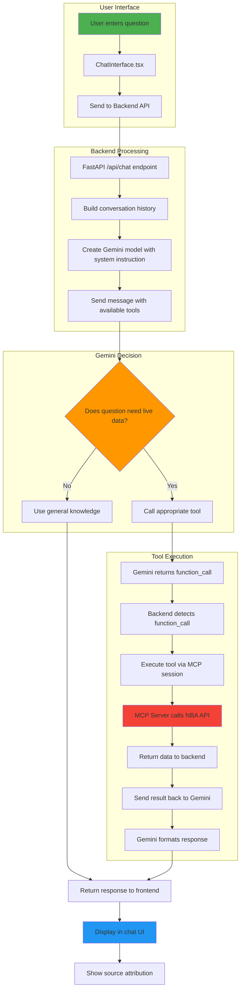

# 🏀 Hoop.io - AI-Powered NBA Assistant

<div align="center">


**Your intelligent companion for NBA stats, live scores, and basketball knowledge**

[Features](#-features) • [Installation](#-installation) • [Usage](#️-usage) • [Technologies](#-technologies)

</div>

---

## 📖 Overview

**Hoop.io** is a sophisticated AI-powered chatbot that combines Google Gemini's natural language understanding with real-time NBA data through the Model Context Protocol (MCP). Ask about historical NBA facts, get live game scores, check player statistics, or explore team standings - all through a beautiful, modern chat interface.

The application intelligently decides when to use its general basketball knowledge versus fetching live data from the NBA API, providing accurate and up-to-date information for all your basketball queries.

---

## ✨ Features

### 🤖 **Intelligent Query Handling**
- **Dual-Mode Intelligence**: Automatically switches between general knowledge and live NBA API data
- **Contextual Conversations**: Maintains conversation history for natural, multi-turn dialogues
- **Smart Tool Selection**: Gemini decides when to call NBA API tools based on query context

### 📊 **Real-Time NBA Data**
- **Live Game Scores**: Get current scores and game status for today's matches
- **League Standings**: Check current NBA standings for both conferences
- **Player Statistics**: Fetch detailed career stats for any NBA player
- **Historical Knowledge**: Ask about NBA history, records, and all-time achievements

### 🎨 **Premium User Interface**
- **Modern Design**: Glassmorphism-inspired dark theme with NBA color accents
- **Two-Column Layout**: AI responses on the left, chat controls on the right
- **Source Attribution**: See whether data came from NBA API or Gemini's knowledge
- **Quick Actions**: One-click access to popular queries
- **Conversation History**: Review and re-ask previous questions

---

## 🚀 Installation

### Prerequisites
- Python 3.13+
- Node.js 18+
- npm or yarn
- Google Gemini API key ([Get one here](https://makersuite.google.com/app/apikey))

### Step 1: Clone the Repository
```bash
git clone <your-repo-url>
cd Assignment4
```

### Step 2: Backend Setup
```bash
# Create and activate virtual environment
python -m venv venv
source venv/bin/activate  # On Windows: venv\Scripts\activate

# Install Python dependencies
pip install -r backend/requirements.txt

# Configure environment variables
cd backend
cp .env.example .env
# Edit .env and add your GOOGLE_API_KEY
```

### Step 3: Frontend Setup
```bash
cd frontend
npm install
```

### Step 4: Start the Application

**Terminal 1 - Backend:**
```bash
# From project root
./venv/bin/uvicorn backend.main:app --reload --port 8000
```

**Terminal 2 - Frontend:**
```bash
cd frontend
npm run dev
```

Visit **http://localhost:5173** in your browser! 🎉

---

## 🛠️ Usage

### Basic Queries

**Historical Questions** (uses Gemini's knowledge):
```
"Which team has won the most NBA titles?"
"Who is the all-time leading scorer?"
"Tell me about Michael Jordan's career"
```

**Live Data** (uses NBA API):
```
"What are today's games?"
"Show me current standings"
"Get Stephen Curry's stats"
```

### Example Conversation
```
You: Who won the most NBA championships?
Hoop.io: The Boston Celtics have won 17 NBA championships.
         Source: Gemini LLM

You: What about the Lakers?
Hoop.io: The Los Angeles Lakers have also won 17 championships, 
         tied with the Celtics for the most all-time.
         Source: Gemini LLM

You: Show me LeBron James' stats
Hoop.io: [Detailed career statistics from NBA API]
         Source: NBA API
```

---

## 📦 Technologies

### Backend
- **FastAPI** - Modern Python web framework
- **Google Gemini 2.0 Flash** - Advanced LLM for natural language understanding
- **MCP (Model Context Protocol)** - Tool integration framework
- **FastMCP** - Python MCP server implementation
- **nba_api** - Official NBA statistics API wrapper
- **Python 3.13** - Latest Python runtime

### Frontend
- **React 18** - UI framework
- **TypeScript** - Type-safe JavaScript
- **Vite** - Next-generation frontend tooling
- **Tailwind CSS v4** - Utility-first CSS framework
- **react-markdown** - Markdown rendering for rich responses

### Architecture
- **MCP Protocol** - Standardized tool calling interface
- **Async/Await** - Non-blocking I/O for better performance
- **RESTful API** - Clean HTTP interface between frontend and backend

---

## 🔧 Configuration

### Environment Variables

Create a `.env` file in the `backend/` directory:

```env
GOOGLE_API_KEY=your_gemini_api_key_here
```

**Getting Your Gemini API Key:**
1. Visit [Google AI Studio](https://makersuite.google.com/app/apikey)
2. Sign in with your Google account
3. Click "Create API Key"
4. Copy the key and paste it into your `.env` file

> ⚠️ **Security Note**: Never commit your `.env` file to version control. The `.gitignore` is already configured to exclude it.

### System Instruction (Optional)

You can customize the AI's behavior by editing the system instruction in `backend/main.py`:

```python
system_instruction = """You are an expert NBA assistant..."""
```

---

## ✅ Requirements

### Python Dependencies
```
fastapi>=0.115.0
uvicorn>=0.32.0
google-generativeai>=0.8.3
mcp>=1.1.2
nba_api>=1.5.2
python-dotenv>=1.0.1
httpx>=0.27.2
```

### Node Dependencies
```json
{
  "react": "^18.3.1",
  "vite": "^6.0.1",
  "tailwindcss": "^4.0.0",
  "react-markdown": "^9.0.1"
}
```

---

## 🗂️ Repository Structure

```
Assignment4/
├── backend/                    # FastAPI backend server
│   ├── main.py                # Main application entry point
│   │                          # - FastAPI app configuration
│   │                          # - MCP client setup and lifespan management
│   │                          # - Chat endpoint with Gemini integration
│   │                          # - Tool calling logic
│   ├── requirements.txt       # Python dependencies
│   ├── .env.example          # Environment variables template
│   ├── .env                  # Your API keys (gitignored)
│   └── .gitignore            # Git ignore rules
│
├── frontend/                  # React frontend application
│   ├── src/
│   │   ├── components/
│   │   │   └── ChatInterface.tsx  # Main chat UI component
│   │   │                          # - Message display and management
│   │   │                          # - User input handling
│   │   │                          # - History and quick actions
│   │   ├── App.tsx               # Root React component
│   │   ├── main.tsx              # React entry point
│   │   └── index.css             # Global styles and Tailwind config
│   ├── package.json              # Node dependencies
│   ├── tailwind.config.js        # Tailwind CSS configuration
│   ├── postcss.config.js         # PostCSS configuration
│   └── vite.config.ts            # Vite build configuration
│
├── mcp-server/                # MCP server for NBA data
│   └── nba_server.py         # FastMCP server implementation
│                             # - get_live_games() tool
│                             # - get_standings() tool
│                             # - get_player_stats() tool
│
├── venv/                      # Python virtual environment (gitignored)
└── README.md                 # This file
```

### Key Components Explained

**`backend/main.py`**
- **Lifespan Manager**: Connects to MCP server on startup, loads NBA tools
- **Chat Endpoint**: Handles user messages, manages conversation history
- **Tool Integration**: Converts MCP tools to Gemini format, executes tool calls
- **Response Handling**: Tracks data source (NBA API vs Gemini LLM)

**`mcp-server/nba_server.py`**
- **FastMCP Server**: Exposes NBA data as MCP tools
- **NBA API Integration**: Uses `nba_api` library for live data
- **Tool Definitions**: Three main tools with clear descriptions and schemas

**`frontend/src/components/ChatInterface.tsx`**
- **State Management**: Tracks messages, input, loading states
- **API Communication**: Sends requests to backend, handles responses
- **UI Rendering**: Two-column layout with glassmorphism design
- **User Interactions**: Input handling, quick actions, history management

---

## 🔗 Flow Chart



### Data Flow Explanation

1. **User Input** → User types question in chat interface
2. **Frontend** → Sends message + history to backend API
3. **Backend** → Prepares context and sends to Gemini with available tools
4. **Gemini Analysis** → Decides whether to use knowledge or call a tool
5. **Tool Execution** (if needed) → Backend calls MCP server → NBA API
6. **Response** → Gemini formats data → Backend adds source tag → Frontend displays

---

## 🤝 Contributing

Contributions are welcome! Here's how you can help:

1. **Fork the repository**
2. **Create a feature branch**: `git checkout -b feature/amazing-feature`
3. **Make your changes** and test thoroughly
4. **Commit your changes**: `git commit -m 'Add amazing feature'`
5. **Push to the branch**: `git push origin feature/amazing-feature`
6. **Open a Pull Request**

### Development Guidelines
- Follow PEP 8 for Python code
- Use TypeScript for new React components
- Add comments for complex logic
- Test with multiple query types before submitting

---

## 📄 Documentation

### Additional Resources
- [Google Gemini API Documentation](https://ai.google.dev/docs)
- [Model Context Protocol Specification](https://modelcontextprotocol.io/)
- [NBA API Documentation](https://github.com/swar/nba_api)
- [FastAPI Documentation](https://fastapi.tiangolo.com/)
- [React Documentation](https://react.dev/)

### Key Concepts
- **MCP (Model Context Protocol)**: A standardized way for LLMs to interact with external tools
- **Function Calling**: Gemini's ability to recognize when to use tools vs general knowledge
- **Agentic Behavior**: The LLM acts as an intelligent agent, making decisions about tool usage

---

## ❤️ Acknowledgements

- **Google Gemini** - For the powerful language model and function calling capabilities
- **Anthropic** - For pioneering the Model Context Protocol
- **nba_api** - For providing easy access to NBA statistics
- **FastAPI** - For the excellent Python web framework
- **React Team** - For the amazing frontend library
- **Tailwind CSS** - For the utility-first CSS framework

Special thanks to the open-source community for making projects like this possible!

---

## 📝 Changelog

### Version 1.0.0 (Current)
- ✅ Initial release with full functionality
- ✅ Integrated Google Gemini 2.0 Flash with MCP
- ✅ Implemented three NBA API tools (live games, standings, player stats)
- ✅ Built premium glassmorphism UI with two-column layout
- ✅ Added conversation history and context management
- ✅ Implemented source attribution (NBA API vs Gemini LLM)
- ✅ Added quick actions and suggested queries
- ✅ Cleaned up dead code and optimized codebase
- ✅ Created comprehensive documentation

### Future Enhancements
- 🔄 Add more NBA tools (team stats, game highlights, playoff brackets)
- 🔄 Implement user authentication and saved conversations
- 🔄 Add data visualization for statistics
- 🔄 Support for multiple sports leagues
- 🔄 Voice input/output capabilities

---

<div align="center">

**Built with ❤️ for basketball fans everywhere**

[Report Bug](https://github.com/yourusername/hoop-io/issues) • [Request Feature](https://github.com/yourusername/hoop-io/issues)

</div>
